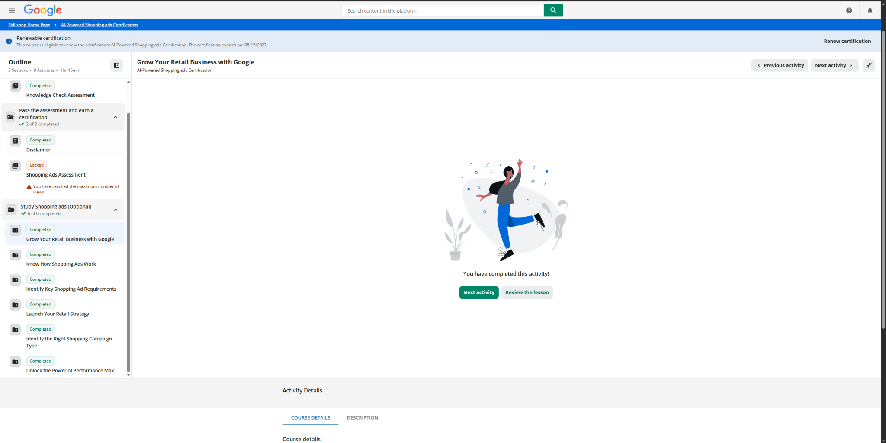

# Google Skillshop Modules

## Launch Your Retail Strategy

Completed the **Launch Your Retail Strategy** module.

## Identify the Right Shopping Campaign Type

Completed the **Identify the Right Shopping Campaign Type** module.

## Unlock the Power of Performance Max

Completed the **Unlock the Power of Performance Max** module.

# Proof of Completion

{width="100%"}

# CPP Farm Store Application Reflection

The retail campaign objective that makes the most sense for CPP Farm Store is increasing awareness and online sales while also supporting visits to the physical store. Our group built the campaign around the new Shopify storefront because the store needs customers to discover the products online and then take an action. The campaign we created, “Fresh This Week — Grown at Cal Poly Pomona,” focused on turning awareness into product page visits, add-to-cart activity, and completed orders. With this in mind the campaign supports both ecommerce and the physical Farm Store instead of treating them as separate parts of the business.

The products that should be prioritized are campus-exclusive products, seasonal products, and gift baskets. These products help CPP Farm Store stand out from larger retailers because they connect directly to Cal Poly Pomona. Gift baskets are also important because they can reach alumni, parents, faculty, staff, visitors, and other gift buyers outside the main student segment. Our project gave Google Shopping Ads \$500 of the \$1,500 six-week campaign budget because it can reach customers with stronger purchase intent and use the product feed our group already created.

A Performance Max approach could also make sense for CPP Farm Store because the business has multiple goals and customer touchpoints. Automation can help reach customers across Google channels, but the campaign still needs clear goals, good product information, creative assets, and enough conversion data to improve. I would not depend only on automation. Our project results showed that the channel and customer experience still matter, so the group would need to monitor performance and make changes when a channel is not converting well.

The campaign should support Google Shopping and Search along with social media, email, the Shopify storefront, campus signage, and the physical Farm Store. Our campaign used seven channels and directed customers toward the same “Fresh This Week” landing page. This makes the customer journey more consistent and also makes the results easier to measure.

The KPIs should include impressions, clicks, click-through rate, product page visits, add-to-cart rate, checkout starts, conversion rate, revenue, and return on ad spend. Our dashboard analyzed 9,023 sessions, \$4,125.51 in revenue, and a 1.75% conversion rate. It also showed that Email converted 30.1% of checkout starts to purchases and Paid Search converted 23.4%, compared with only 5.7% for Social. This shows why the group should look past traffic and focus on whether the traffic actually turns into sales.

We applied these ideas together across the Campaign Plan, Creative Brief, and Dashboard. The Campaign Plan established the audience, products, channels, and budget. The Creative Brief kept the “Fresh This Week” message consistent, and the Dashboard showed where customers were converting or dropping off. By connecting all three, CPP Farm Store can use performance results to improve future campaign decisions.

# Appendix

[Published Report](https://brahhmen55.github.io/IBM6300/)

[GitHub Repository](https://github.com/Brahhmen55/IBM6300)
