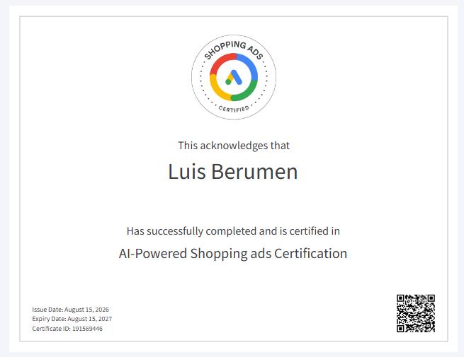

# Google Shopping Ads Certification Assessment

Completed the **Google Shopping Ads Certification assessment** in Google Skillshop.

# Proof of Certification Completion

{width="100%"}

# Final Application Summary

The three most useful concepts I learned from the Google Shopping Ads certification were the importance of product information, choosing a retail campaign strategy based on the objective, and using performance measurement to improve the campaign. Product information is important because the title, image, price, availability, and landing page all affect what the customer sees. Campaign strategy is important because a retailer needs to decide what products to promote, who the audience is, and what action they want the customer to take. Lastly measurement is important because a campaign can generate a lot of traffic without generating the same level of sales.

The certification helped me understand CPP Farm Store’s omnichannel opportunities because our group project connected several parts of the customer experience. We created a Shopify prototype with a product catalog, gift basket customization, cart, and BOPIS checkout. We also created a Google Merchant Center feed with 18 offers across six categories and a campaign called “Fresh This Week — Grown at Cal Poly Pomona.” With this in mind I can see how Google Shopping, Shopify, social media, email, campus signage, and the physical Farm Store can work together instead of being separate channels.

I personally applied this knowledge throughout the project because our group worked together on every part. We all contributed to the customer journey, Shopify prototype, product feed, campaign plan, creative work, and analytics dashboard. This gave me a better understanding of how one decision affects another part of the project. For example, the product feed depends on accurate product information, the campaign depends on having products worth promoting, and the dashboard shows whether customers actually moved from discovery to purchase.

The part I now feel more confident discussing professionally is the relationship between Shopping Ads, retail media, and performance. Our dashboard had 9,023 sessions, \$4,125.51 in tracked revenue, and a 1.75% conversion rate. The results also showed that Social generated a lot of traffic but converted checkout starts to purchases at only 5.7%, while Paid Search converted 23.4% and Email converted 30.1%. Another important finding was that only about 15% of product page visitors added an item to their cart. These results helped me understand that clicks alone do not show if a campaign is successful. The full customer funnel needs to be measured.

On my resume or LinkedIn profile I could list the AI-Powered Shopping Ads Certification and describe skills in Google Shopping Ads, product feeds, Performance Max, omnichannel retail strategy, ecommerce, and campaign measurement. I could also explain that I applied these skills in a CPP Farm Store consulting project where my group developed an ecommerce prototype, Google Merchant Center product feed, retail campaign, creative strategy, and performance dashboard. This gives me a better example to discuss professionally because I can connect the certification concepts to work I actually completed with my group.

# Appendix

[Published Report](https://brahhmen55.github.io/IBM6300/)

[GitHub Repository](https://github.com/Brahhmen55/IBM6300)
