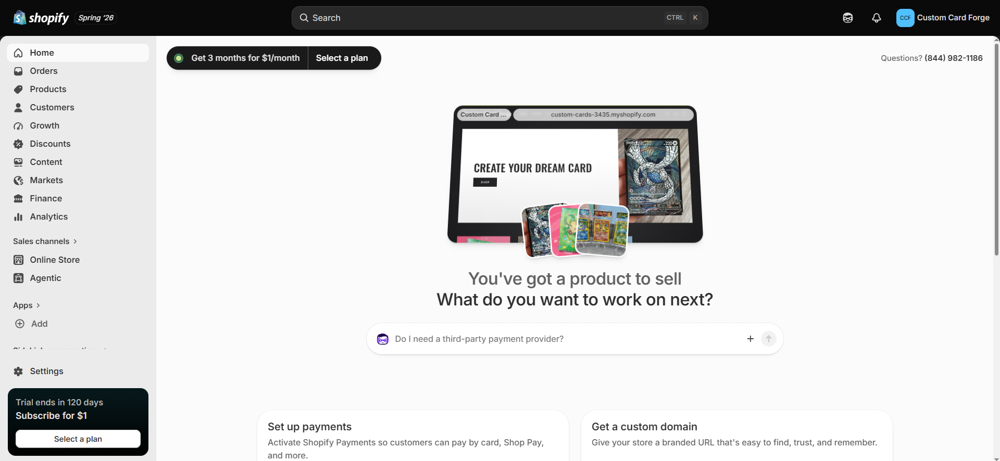
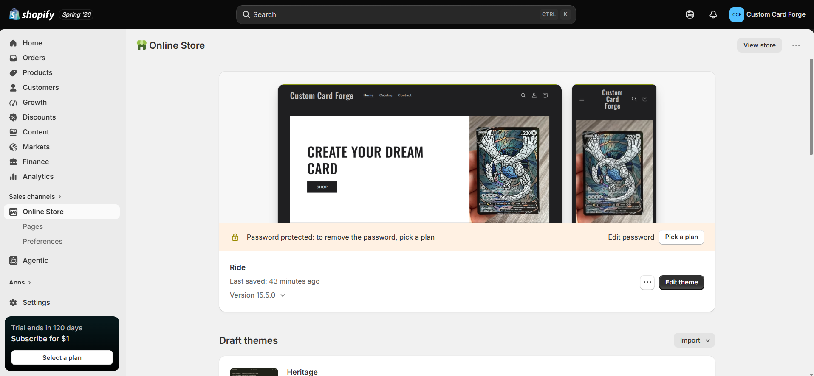
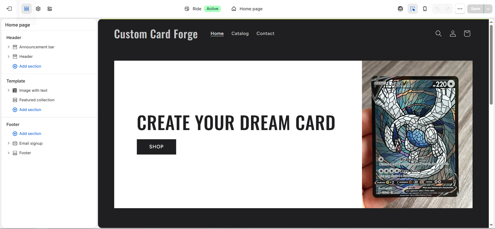

# Store Name and Concept

**Custom Card Forge** is a store that specializes in custom Pokémon-inspired trading card products for collectors, hobbyists, gamers, and gift shoppers. Instead of selling official Pokémon cards, the store focuses on personalized trading card products where customers can submit their own artwork ideas, character concepts, or creative direction. Where customers can create their dream custom card and then protect or display it with matching binders and accessories.

# Target Customer

::: callout-tip
## Customer Profile at a Glance

**Age:** 16–35\
**Interests:** Pokémon, trading cards, collecting\
**Shopping behavior:** Enjoys personalized products, creative gifts, and collectible accessories
:::

The target customer for Custom Card Forge is a trading card fan who enjoys collecting, customizing, and displaying cards. This customer is likely interested in Pokémon, trading card games, gaming culture, and personalized collectibles. They may already own cards and want custom products that make their collection feel more unique. Overall, the target customer is not only buying a product. They are buying something personal that helps express their creativity and connection to the trading card hobby.

This customer is likely:

- A Pokémon or trading card collector looking for personalized display pieces.
- A gamer or hobbyist who enjoys creative collectibles.
- A collector who wants binders, sleeves, and slabs to protect their cards.
- A customer who values custom artwork and products that cannot be found in a regular retail store.

# Product Category Plan

Custom Card Forge focuses on **three main product categories**. These categories are intentionally connected so that customers can create, store, and protect their custom trading cards.

| \# | Product Category | Description | Customer Value |
|-----------------:|------------------|------------------|------------------|
| 1 | Custom Pokémon-Inspired Cards | Customers submit artwork ideas, character concepts, or creative details for a personalized custom trading card. | Gives customers a one-of-a-kind card based on their own idea. |
| 2 | Custom Card Binders | Personalized binders designed to store custom cards or any trading card collection. | Helps customers organize and protect their collection. |
| 3 | Custom Card Accessories | Custom sleeves, protective slabs, and other card protection products. | Allows customers to display and preserve their cards professionally. |

::: callout-important
## Complete Collection Strategy

The product plan is designed around a complete collection experience. A customer can order a custom card, store it in a custom binder, and protect it with matching accessories like sleeves or slabs. This makes the store feel focused instead of random.
:::

## Product Logic

The store only offers three product groups because a smaller product mix makes the shopping experience easier to understand. Each product category supports the same overall purpose: helping customers create and protect a personalized trading card collection.

::: panel-tabset
## Custom Cards

Custom cards are the main product because they give the customer a personalized item based on their own idea or artwork direction.

## Custom Binders

Custom binders support the main card product by giving customers a place to store their cards safely.

## Accessories

Accessories such as sleeves and slabs help customers protect and display their cards after purchase.
:::

# Initial Shopify Setup Evidence

## Shopify Admin Area

{#fig-admin}

## Selected Theme

{#fig-theme}

## Homepage Draft

{#fig-homepage}

# Connection to CPP Farm Store

Although Custom Card Forge focuses on custom trading card products instead of agricultural products, the Shopify setup process connects directly to the CPP Farm Store project. Both stores need a clear target customer, organized product categories, and a storefront that communicates the brand quickly. Creating this store helped me think more carefully about how customers experience an online retail store. For Custom Card Forge, the homepage needs to immediately explain the custom card concept. For CPP Farm Store, the website would also need to quickly explain what makes the store unique, such as its connection to Cal Poly Pomona, local products, and farm-based identity.

The product organization is also important. Custom Card Forge uses three simple categories: custom cards, binders, and accessories. This same idea can apply to CPP Farm Store by organizing products into clear groups so customers can easily find what they are looking for. Branding, product categories, theme selection, and homepage design are not just design choices. They affect how customers understand the store and decide whether to keep shopping.

# Appendix

## Project Links

[Published Report](https://brahhmen55.github.io/IBM6300/)
