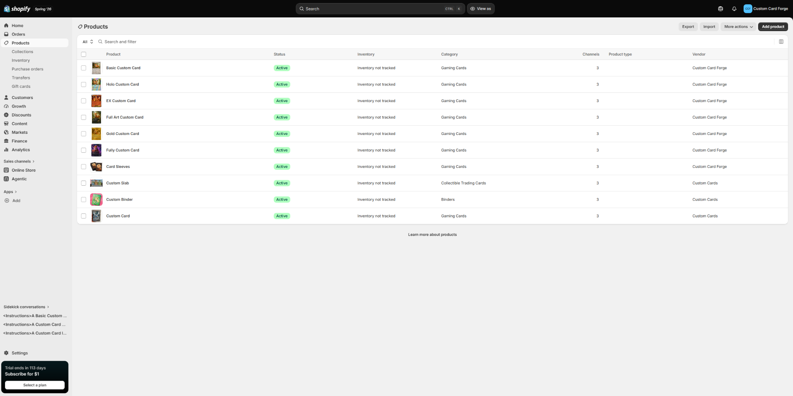
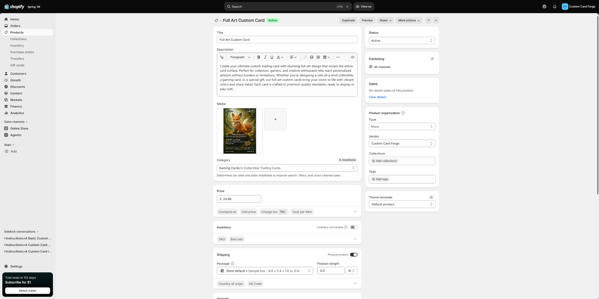
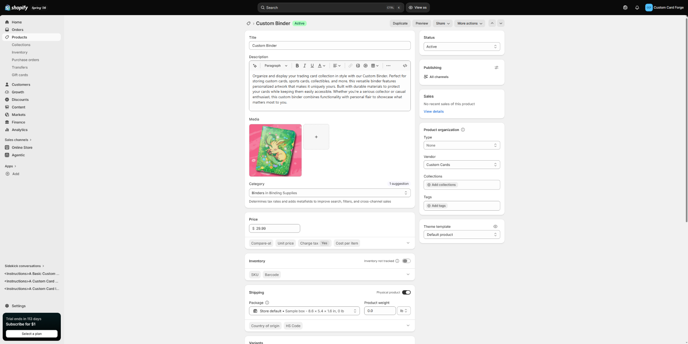
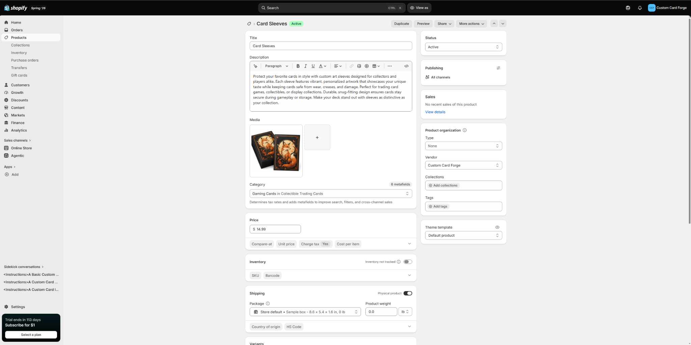

# Product List

The Shopify catalog includes 10 products. The products are organized around custom trading cards and accessories that support collecting, protecting, and displaying cards.

| \# | Product Name | Category | Price | Catalog Role |
|--------------:|---------------|---------------|--------------:|---------------|
| 1 | Basic Custom Card | Gaming Cards | \$19.99 | Entry-level custom card option |
| 2 | Holo Custom Card | Gaming Cards | \$29.99 | Mid-tier card with a holographic-style look |
| 3 | EX Custom Card | Gaming Cards | \$39.99 | Premium card style with stronger visual effects |
| 4 | Full Art Custom Card | Gaming Cards | \$24.99 | Full-art card design focused on display value |
| 5 | Gold Custom Card | Gaming Cards | \$59.99 | Higher-end collector card tier |
| 6 | Fully Custom Card | Gaming Cards | \$99.99 | Most personalized and premium card option |
| 7 | Card Sleeves | Gaming Cards | \$14.99 | Protective accessory for cards |
| 8 | Custom Slab | Collectible Trading Cards | \$24.99 | Display and protection product |
| 9 | Custom Binder | Binders | \$29.99 | Storage product for card collections |
| 10 | Custom Card | Gaming Cards | \$19.99 | Additional custom card option |

::: callout-important
## Product Catalog Strategy

The product list creates a clear pricing ladder. Customers can start with an affordable basic card, move up to higher-end custom card tiers, and then add accessories such as sleeves, slabs, or a binder to protect and organize their collection.
:::

# Product Information Evidence

## Product Catalog List

{#fig-productlist}

## Product Admin Page Evidence

::: panel-tabset
## Custom Card Product

{#fig-customcard}

## Custom Binder Product

{#fig-binder}

## Card Sleeves Product

{#fig-sleeves}

The Card Sleeves product is an accessory designed to protect trading cards from scratches and wear. This product supports the store concept because customers who buy custom cards may also want protective sleeves to keep their cards in good condition.
:::

# Product Description Quality

The product descriptions were written to be customer-friendly instead of only listing basic specifications. Each description explains what the product is, how it is used, and why a customer might want it. For example, the custom card descriptions focus on personalization, display value, and collector appeal.

::: callout-tip
## Customer-Friendly Description Approach

A strong product description should answer three questions:

1.  What is the product?
2.  Why would the customer want it?
3.  How does it fit into the overall store concept?
:::

The descriptions in this catalog follow that approach by connecting each product to the needs of trading card collectors. Instead of only saying “card sleeve” or “custom binder,” the descriptions explain how those products help customers protect, store, and personalize their collections.

# Assortment Strategy Reflection

The product assortment for Custom Card Forge is designed around a complete collecting experience. The custom card tiers give customers different levels of personalization and visual quality, ranging from basic custom cards to premium fully custom cards. This creates a pricing ladder that allows customers to choose a product based on their budget and interest level. The accessories, including card sleeves, slabs, and binders, support the main custom card products by helping customers protect, organize, and display their cards. These products belong together because they all serve the same target customer: trading card collectors who value personalization, presentation, and protection.

# CPP Farm Store Application Reflection

The CPP Farm Store should consider how product information, product organization, and product images affect the online shopping experience. Customers need clear product titles, useful descriptions, accurate prices, quality photos, and availability before they decide to purchase. CPP Farm Store could group related products into clear categories such as produce, pantry goods, gifts, and seasonal items so customers can browse easily. Product descriptions should explain not only what the item is, but also why it is valuable, such as freshness, local connection, campus identity, or seasonal appeal. A clear online catalog would help CPP Farm Store present its products in a more organized and appealing way while making it easier for customers to understand the assortment and make purchase decisions.

# Appendix

::: callout-note
## Project Links

- **GitHub Repository:** <https://github.com/Brahhmen55/IBM6300>
- **GitHub Pages:** <https://brahhmen55.github.io/IBM6300/>
:::
