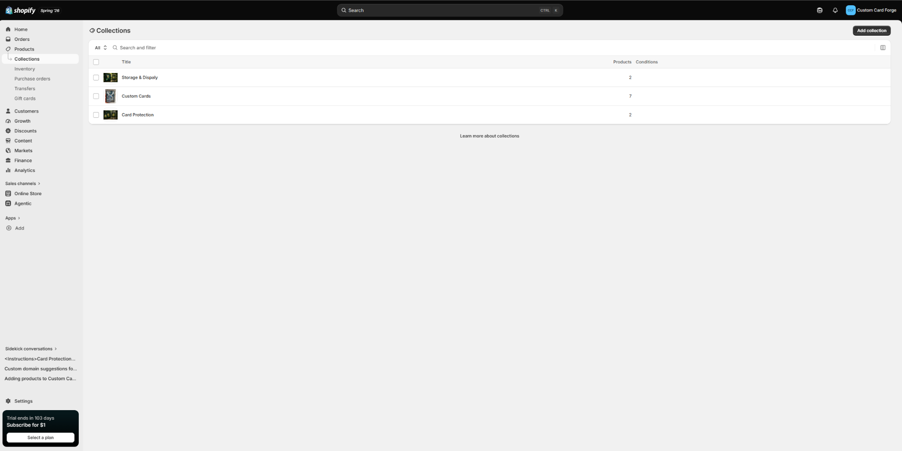
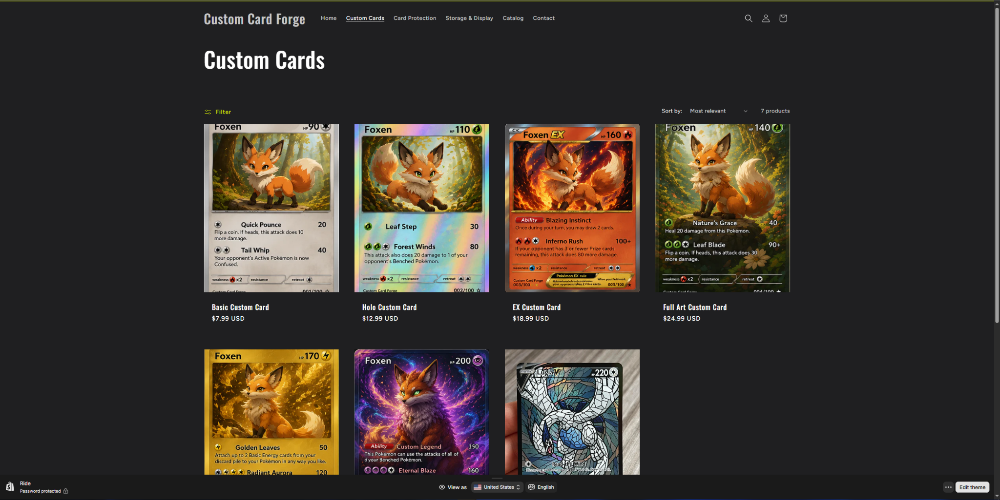
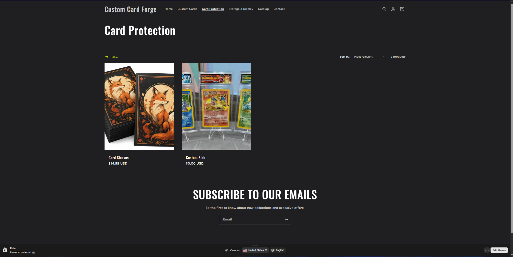
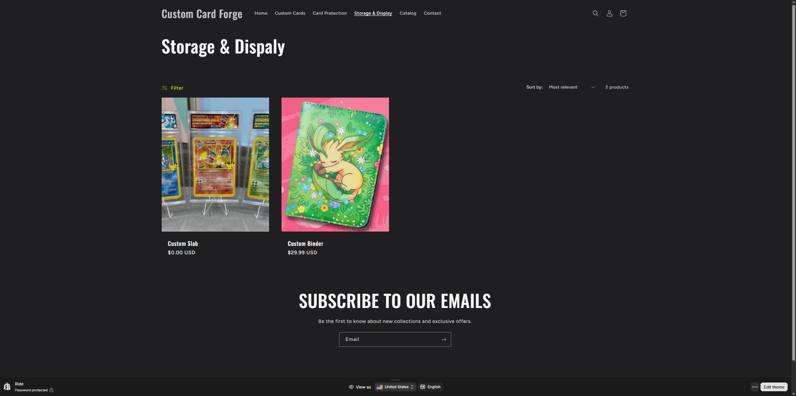
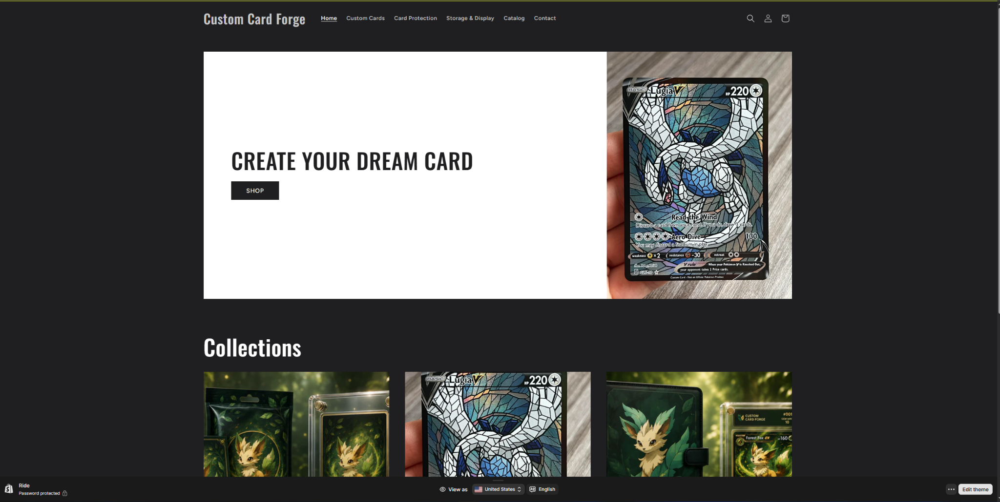

# Collections and Categories

| \# | Collection | Products Included | Purpose |
|---:|----|----|----|
| 1 | Custom Cards | Basic, Holo, EX, Full Art, Gold, Fully Custom, and Custom Card | Lets customers compare custom card styles and price levels. |
| 2 | Card Protection | Card Sleeves and Custom Slab | Groups products that protect cards from damage and wear. |
| 3 | Storage & Display | Custom Binder and Custom Slab | Groups products used to organize, store, and showcase cards. |

::: callout-important
## Collection Strategy

The Custom Slab appears in both **Card Protection** and **Storage & Display** because it serves both purposes. This makes the product easier to find based on how customers plan to use it.
:::

# Collections in Shopify Admin

{#fig-collections-admin}

# Storefront Collection Pages

::: panel-tabset
## Custom Cards

{#fig-custom-cards}

## Card Protection

{#fig-card-protection}

## Storage & Display

{#fig-storage-display}
:::

# Main Navigation Menu

{#fig-navigation}

As shown in @fig-navigation, the collection links appear directly in the main navigation. Customers can immediately choose the section that matches their shopping goal.

::: callout-tip
## Navigation Goal

The navigation answers the customer's main question quickly: **Am I shopping for a custom card, protection, or storage and display?**
:::

# Merchandising Logic Explanation

The products were organized into **Custom Cards**, **Card Protection**, and **Storage & Display** because these collections represent the main stages of the customer's collecting experience. The Custom Cards collection contains the store's primary personalized products, ranging from basic cards to premium fully custom cards. Card Protection includes sleeves and slabs that help preserve cards, while Storage & Display includes products that help customers organize and showcase their collections. This structure keeps related products together and encourages customers who purchase a custom card to then consider worthwhile accessories.

# Customer Experience Explanation

The navigation structure helps customers shop more easily by giving them direct access to the store's major sections. A customer interested in designing a card can select **Custom Cards**, while someone looking for protective products can choose **Card Protection** without browsing the full catalog. Customers interested in organizing or displaying cards can use **Storage & Display**. The clear labels reduce unnecessary clicks and help customers understand the assortment immediately and get to where they want as fast as possibe.

# CPP Farm Store Application Reflection

CPP Farm Store could organize its online products into customer-friendly categories such as **Fresh Produce**, **Pantry and Packaged Foods**, **Gifts and Apparel**, **Plants and Garden Products**, and **Seasonal Items**. These categories would help customers identify available products instead of browsing one large catalog. The main navigation should use simple labels that match how customers naturally shop in store. CPP Farm Store could also feature seasonal collections, campus-made products, local items, and popular gifts in the navigation.

# Appendix

::: callout-note
## Project Links

- **GitHub Repository:** [IBM6300 Repository](https://github.com/Brahhmen55/IBM6300)

- **GitHub Pages Live Report:** [IBM6300 GitHub Pages](https://brahhmen55.github.io/IBM6300/)
:::
