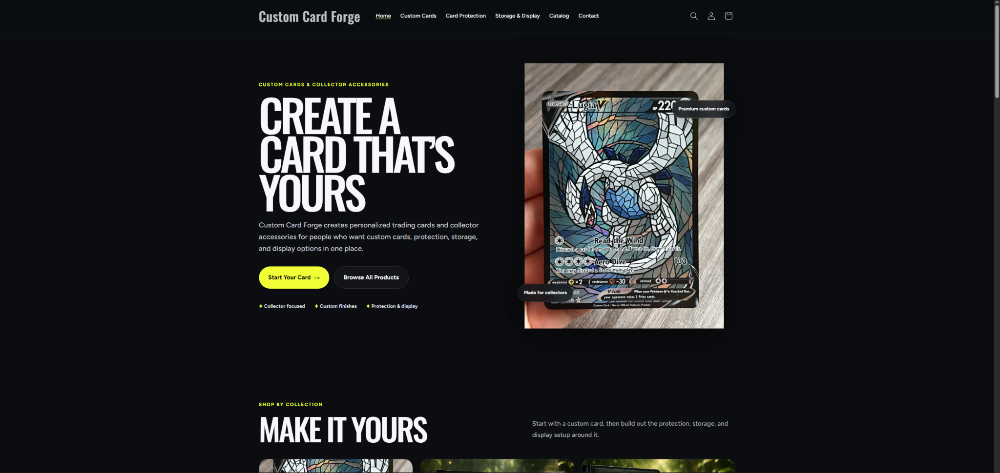
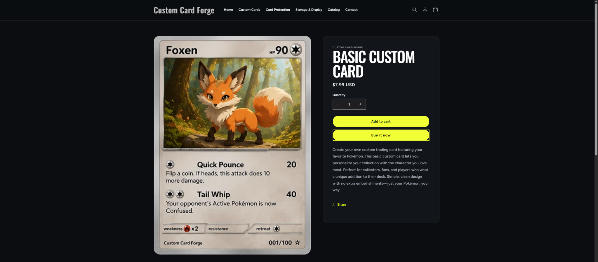
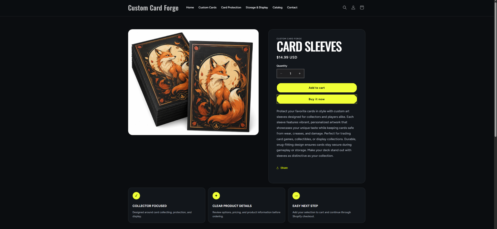
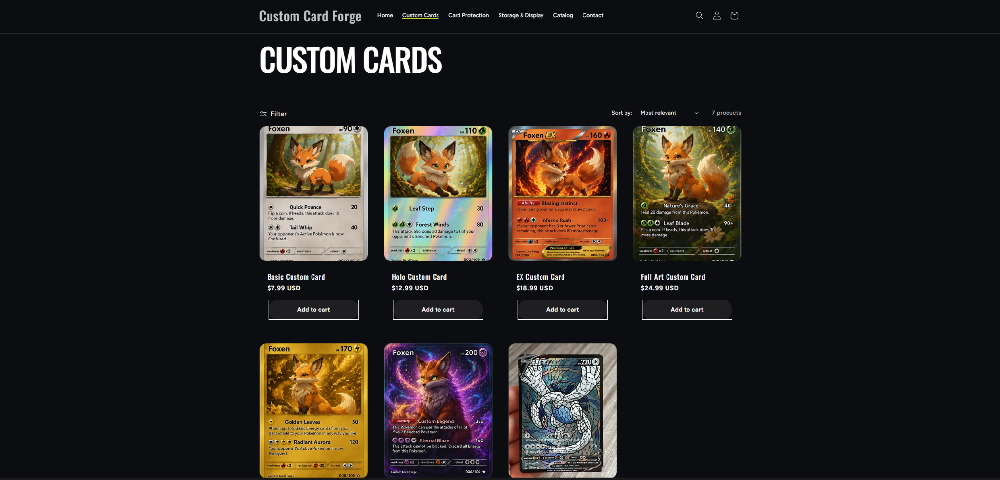
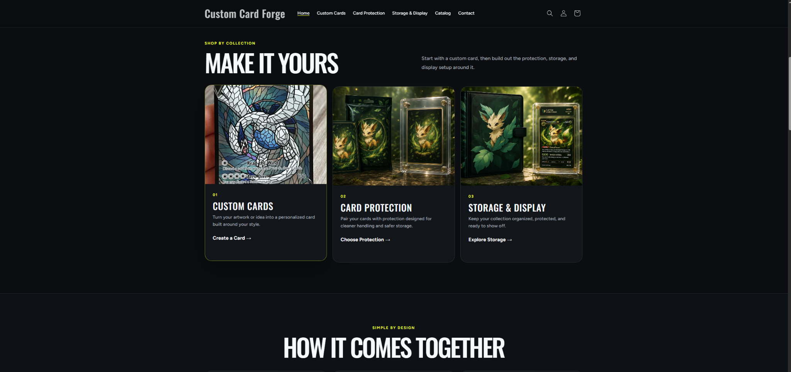
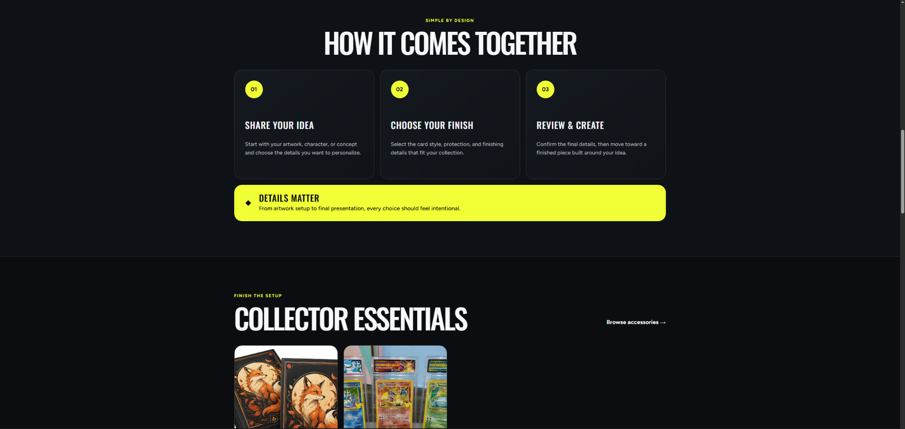
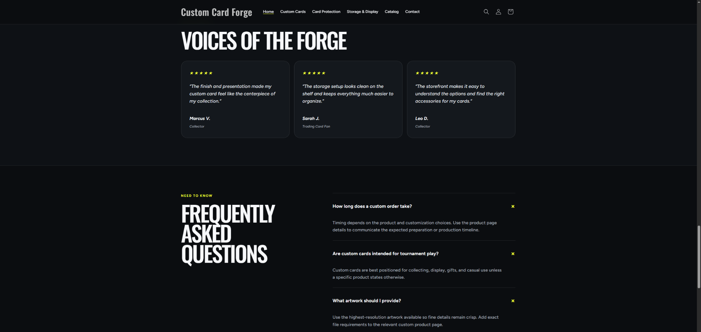
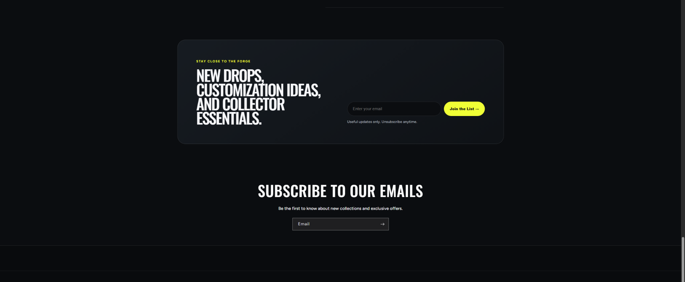

# Homepage Improvement

I redesigned the homepage so customers can immediately understand what **Custom Card Forge** sells and where to go next. The updated hero section introduces the store as a place for personalized trading cards and collector accessories. It also includes two clear calls to action, **Start Your Card** and **Browse All Products**, which guide customers toward product discovery. The main navigation gives direct access to **Custom Cards**, **Card Protection**, **Storage & Display**, the full catalog, and contact information. The beginning of the **Shop by Collection** section is also visible below the hero, helping customers continue shopping without having to search for the main product categories.

{#fig-homepage}

::: callout-tip
## Homepage Goal

The homepage communicates the store's main purpose quickly and gives customers clear next steps instead of making them search through the full catalog.
:::

# Product Page Improvements

The product pages were improved to create a cleaner and more consistent shopping experience. Important information such as product imagery, product name, price, quantity, purchasing controls, and product description is presented in a clear layout. Bright purchase buttons stand out against the dark background, making the next step easy to identify. The same visual system is used across different product types so the storefront feels consistent.

## Basic Custom Card

{#fig-product-basic}

The **Basic Custom Card** page makes the main product easy to evaluate. Customers can see a large product image while the information panel clearly displays the product name, price, quantity controls, **Add to cart**, **Buy it now**, and a description explaining what the customer is purchasing.

## Card Sleeves

{#fig-product-sleeves}

The **Card Sleeves** page shows that the improved design works consistently for accessory products as well as custom cards. In addition to the main product information and purchase controls, the page includes customer-focused benefit cards such as **Collector Focused**, **Clear Product Details**, and **Easy Next Step**, which reinforce the purpose of the product page and help customers move toward checkout.

# Collection Page Improvement

The collection page was improved to make comparison and product discovery easier. Products are displayed in a clean grid with consistent images, product names, prices, and direct **Add to cart** buttons. Customers can also use filter and sorting controls to narrow or reorganize the products shown. This makes it easier to compare different custom card styles and price levels without opening every product page first.

{#fig-collection}

::: callout-important
## Collection Experience

The collection page gives customers both visual comparison and direct purchasing options, reducing unnecessary clicks during product discovery.
:::

# Customer Experience Improvements

I made several customer experience improvements throughout the storefront. The following four screenshots show how the updated design helps customers discover products, understand the customization process, build trust, and stay connected with the store.

## 1. Clear Collection Navigation

{#fig-cx-collections}

The **Shop by Collection** section creates three clear shopping pathways: **Custom Cards**, **Card Protection**, and **Storage & Display**. Each category includes a short description and a direct action link. This improves navigation because customers can choose the section that matches their shopping goal rather than browsing the entire catalog.

## 2. Clear Customization Process

{#fig-cx-process}

The **How It Comes Together** section explains the custom ordering experience in three steps: **Share Your Idea**, **Choose Your Finish**, and **Review & Create**. This reduces uncertainty by explaining what customers should expect before they begin a custom order. The **Collector Essentials** section below it also encourages customers to continue exploring accessories after understanding the customization process.

## 3. Trust, Social Proof, and Frequently Asked Questions

{#fig-cx-trust}

The **Voices of the Forge** testimonials provide social proof by showing positive customer experiences. The **Frequently Asked Questions** section addresses common concerns about custom-order timing, intended use, and artwork requirements. Together, these sections help make the storefront feel more trustworthy and informative for a first-time customer.

## 4. Customer Engagement

{#fig-cx-newsletter}

The newsletter section gives customers a way to stay connected with the store after their visit. It highlights **new drops, customization ideas, and collector essentials** and provides a simple email signup field. This creates an additional customer relationship beyond a single shopping session.

# Customer Journey Reflection

A customer entering my storefront begins on the homepage, where the hero section immediately explains that Custom Card Forge offers personalized trading cards and collector accessories. From there, the customer can use the main navigation or the **Shop by Collection** section to choose between Custom Cards, Card Protection, and Storage & Display. A customer interested in a personalized card can also review the **How It Comes Together** section to understand the ordering process before shopping. After selecting a collection, the customer can compare related products using the product grid, prices, filtering, and sorting tools. Selecting a product opens a detailed product page where the customer can review the image, price, description, quantity, and purchasing options before adding the item to the cart or buying it immediately. Testimonials and frequently asked questions help build confidence along the way, while the newsletter provides a way to remain connected after the visit. Overall, the redesigned storefront creates a clear path from brand introduction to product discovery, product evaluation, and purchase.

# CPP Farm Store Application Reflection

CPP Farm Store should design its online storefront around the same principle of making the customer's next step obvious. The homepage should quickly communicate what the Farm Store sells and highlight major categories such as fresh produce, pantry products, gifts, plants, and seasonal items. Featured collections and clear calls to action could help customers move directly into the category that interests them. Product pages should include high-quality images, clear pricing, availability, size or quantity information, and useful details about where the product comes from. The store could also explain its connection to Cal Poly Pomona's agricultural programs to strengthen its story and build trust. Frequently asked questions could address topics such as pickup, product availability, seasonal changes, and store policies. A mobile-friendly layout would also be important because customers may browse products while traveling to campus or while deciding what to purchase before visiting the physical Farm Store.

# Appendix

::: callout-note
## Project Links

- **GitHub Repository:** [IBM6300 Repository](https://github.com/Brahhmen55/IBM6300)

- **GitHub Pages Live Report:** [IBM6300 GitHub Pages](https://brahhmen55.github.io/IBM6300/)
:::
