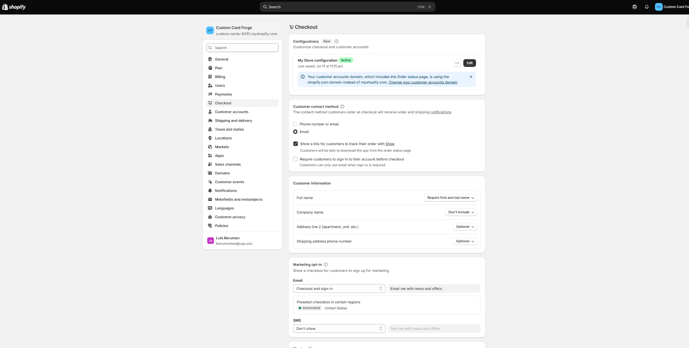
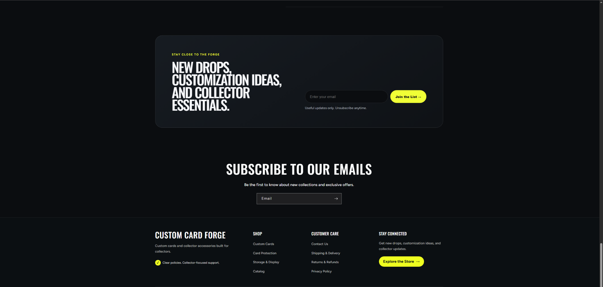

# Checkout Review Evidence

I reviewed the Shopify checkout settings for **Custom Card Forge** to better understand how customers provide information and receive updates during checkout. The store has an active checkout configuration. I reviewed settings related to the customer contact method, order and shipping notifications, Shop order tracking, account sign-in, and customer information requirements. This review helped me think about how checkout settings can reduce uncertainty and give customers clearer communication without activating or processing real payments for the assignment.

{#fig-checkout-review}

::: callout-note
## Checkout Review

The checkout review focused on customer communication, order tracking, account options, and information collected during checkout. No real transaction was required or processed for this assignment.
:::

# Shipping and Delivery Information

I added shipping and delivery information so customers know what to expect after placing an order. Because Custom Card Forge sells both personalized products and standard collector accessories, the policy explains that processing time can depend on the type of product and customization selected.

## Shipping & Delivery Policy

At Custom Card Forge, we want customers to know what to expect after placing an order.

### Order Processing

Custom cards may require additional preparation time because they are personalized for each customer. Processing time may vary depending on the product, customization options, and order volume.

Collector accessories that do not require customization may be prepared more quickly.

### Shipping

Available shipping options and applicable shipping costs are displayed during checkout before an order is completed. Delivery time may vary depending on the destination and shipping service selected.

Customers should review their shipping address carefully before submitting an order. An incorrect or incomplete address may cause delays.

### Order Tracking

When tracking information is available, customers may receive shipping and order-status updates using the contact information provided during checkout.

### Delays

Delivery estimates are not guaranteed. Carrier delays, weather, holidays, and other circumstances outside of our control may affect delivery.

### Questions About an Order

If a customer has a question about shipping or an order, they can contact Custom Card Forge through the Contact page and include their order number when available.

# Return and Refund Policy

I added a return and refund policy that distinguishes between personalized products and standard accessories. This is important for Custom Card Forge because a custom card is created specifically for an individual customer and cannot always be handled the same way as a standard product.

## Returns & Refunds

We want customers to be satisfied with their Custom Card Forge order. Because some of our products are personalized, return eligibility depends on the type of product purchased.

### Custom and Personalized Products

Custom cards and other personalized products are created specifically for the customer. For this reason, personalized products generally cannot be returned or exchanged because of a change of mind after production has begun.

If a personalized item arrives damaged, defective, or significantly different from the approved order details, customers can contact us so we can review the issue.

### Standard Accessories

Non-personalized collector accessories may be eligible for return if they are unused, in their original condition, and in their original packaging.

Customers should contact us before returning an item so that we can review the request and provide instructions.

### Damaged or Incorrect Items

If an order arrives damaged or an incorrect item is received, customers should contact us as soon as possible. They should include the order number, a description of the problem, and photographs when appropriate.

### Refunds

Approved refunds will be issued to the original payment method when possible. Processing time may vary depending on the payment provider.

### Contact Us

Questions about returns, damaged products, or refunds can be submitted through the Custom Card Forge Contact page.

# Privacy and Customer Data Statement

I added a customer data statement to explain why customer information may be collected and how it relates to operating the store. The goal is to make customers more comfortable providing information needed for orders, shipping updates, support, and optional marketing communications.

## Customer Data and Privacy

Custom Card Forge respects the privacy of our customers.

When customers interact with our store, we may receive information necessary to provide the shopping experience, such as a name, contact information, shipping information, order information, and details voluntarily provided for a custom order.

We use customer information for purposes such as processing and fulfilling orders, providing order and shipping updates, responding to customer questions, supporting custom product requests, improving the shopping experience, and sending marketing communications when a customer has chosen to receive them.

Customer information should only be collected and used when necessary for legitimate store operations and customer service. Customers may contact us if they have questions about how their information is handled.

Payment information used during checkout is handled through the payment services available through the Shopify checkout process. Custom Card Forge does not ask customers to send sensitive payment information through the store's contact form.

Customers who subscribe to marketing communications may unsubscribe using the options provided in those communications.

# Contact Information

I added a visible Contact option to the storefront so customers have a clear place to ask questions about custom products, orders, shipping, returns, or other concerns. The Contact link is also available in the Customer Care area of the footer.

## Contact Custom Card Forge

Have a question about a custom card, collector accessory, existing order, shipping, or return? We're happy to help.

Customers can use the store's contact form to send a message. If the question is about an existing order, customers should include their order number so the issue can be reviewed more efficiently.

### Custom Order Questions

Customers with questions about creating a custom card can describe the type of card or customization they are interested in. Customers should not submit sensitive personal or payment information through the contact form.

### Order Support

For questions about an existing order, shipping, damaged items, or returns, customers can provide their order number and a short description of the issue.

Messages can then be reviewed and answered using the contact information the customer provides.

# Storefront Trust Signals

In addition to writing the policies, I made the information easy to find from the storefront. The updated footer contains direct links to **Contact Us**, **Shipping & Delivery**, **Returns & Refunds**, and **Privacy Policy**. It also includes Custom Card Forge branding, shopping links, a newsletter area, and the message **Clear policies. Collector-focused support.** This allows customers to reach important information from the storefront instead of having to search for it.

{#fig-trust-footer}

# Trust Signals Reflection

Clear policies and store information can make customers feel more confident because they reduce uncertainty before a purchase. A customer can review how shipping works, understand the limits on returns for personalized products, learn how customer information may be used, and find a clear way to contact the store if a problem occurs. Making these links visible in the storefront footer also improves credibility because customers do not have to search for important information. Checkout communication, order tracking, customer support, policy transparency, and consistent store branding work together as trust signals. For a store selling personalized products, this is especially important because customers need to understand what will happen after they submit a custom order and what options they have if something goes wrong.

# CPP Farm Store Application Reflection

Trust signals would be especially important for the CPP Farm Store because customers may be purchasing fresh, seasonal, or perishable products and may need information before deciding to order or visit the store. The online storefront should clearly explain product availability, pickup instructions, operating or pickup times, payment expectations, and policies for products that may not be returnable because of their condition or perishability. Clear contact information would allow customers to ask about availability or resolve order problems. The Farm Store could also strengthen trust by clearly identifying its connection to Cal Poly Pomona and explaining where appropriate how products relate to the university's agricultural programs. Visible privacy information and secure checkout communication would provide additional confidence when customers share personal or payment information online.

# Appendix

::: callout-note
## Project Links

- **GitHub Repository:** [IBM6300 Repository](https://github.com/Brahhmen55/IBM6300)

- **GitHub Pages Live Report:** [IBM6300 GitHub Pages](https://brahhmen55.github.io/IBM6300/)
:::

