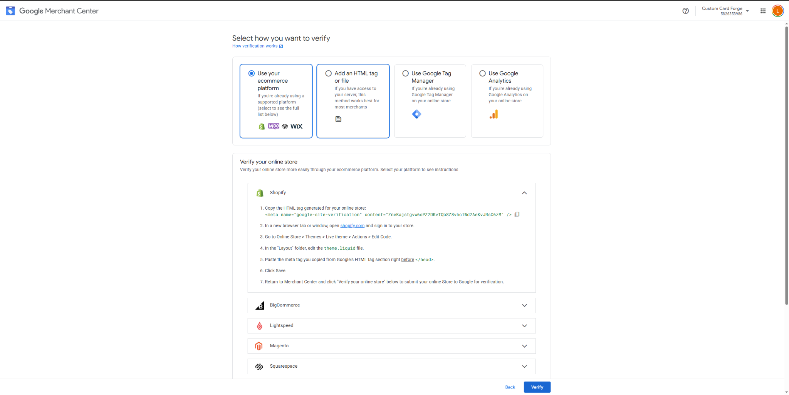
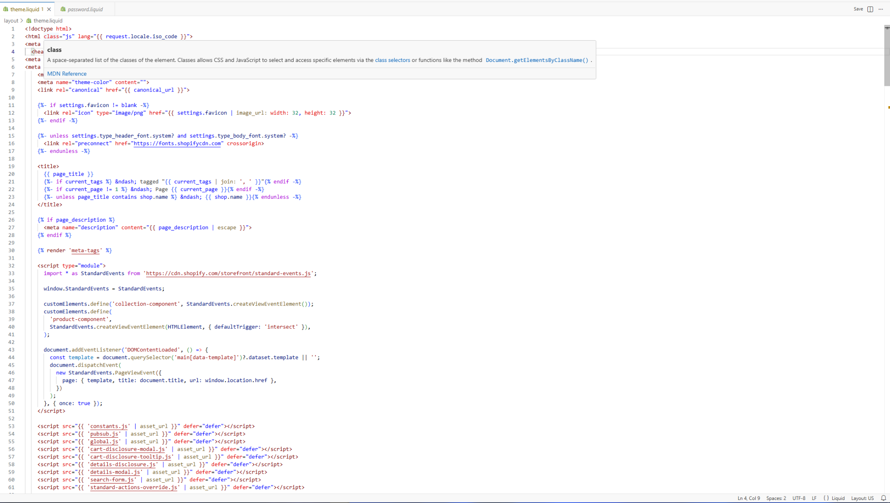
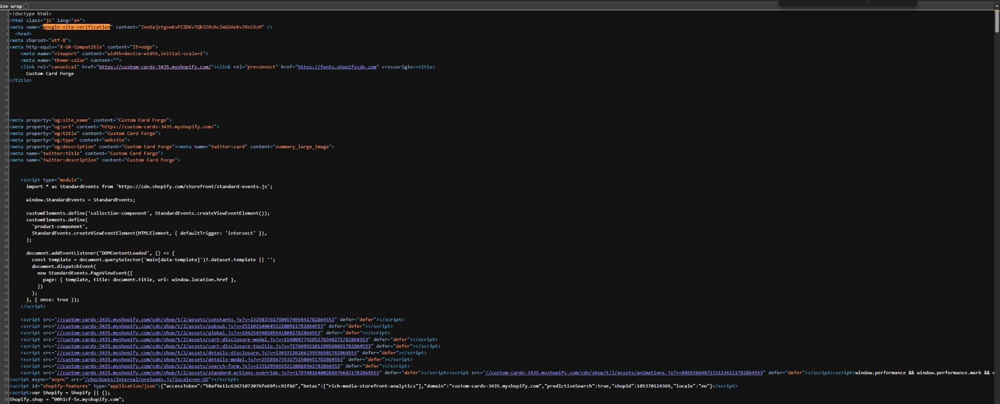
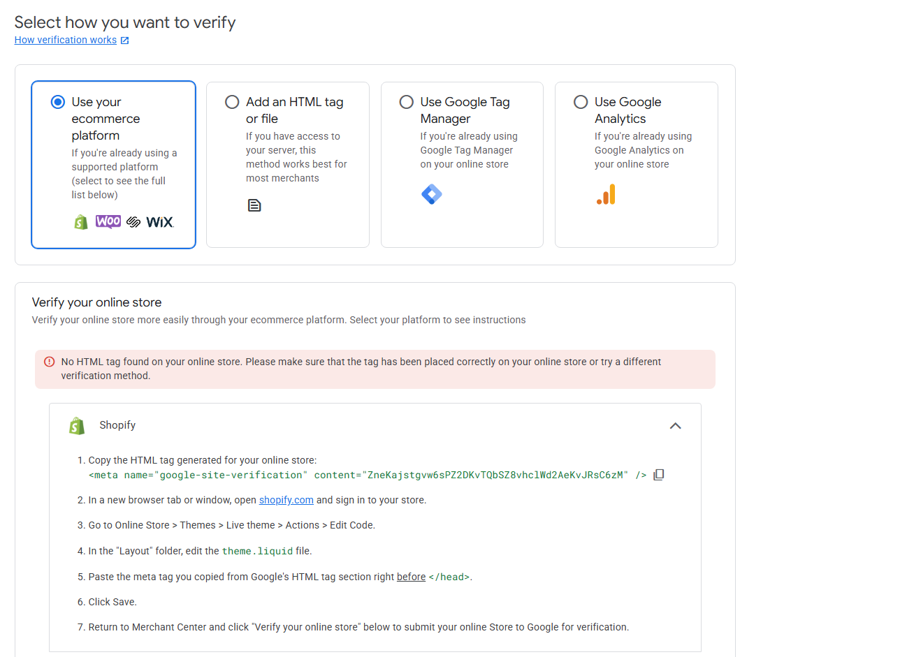
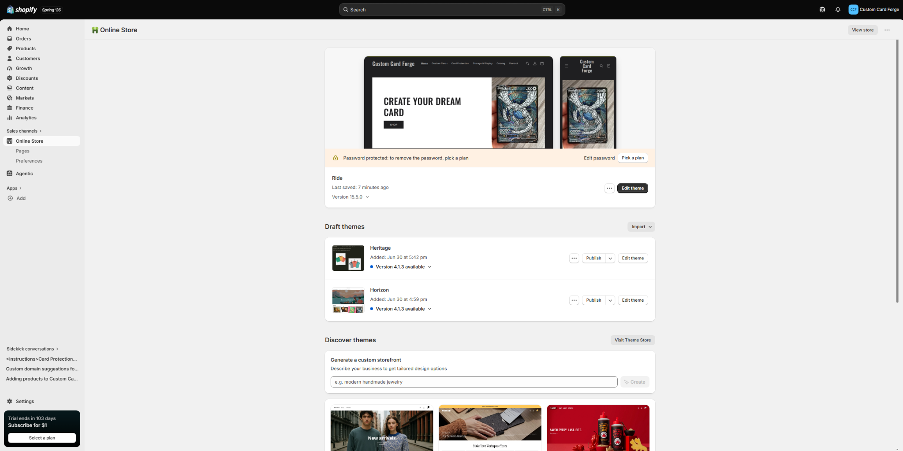

# Connection Attempt Evidence

## Merchant Center Verification Instructions

{#fig-verification-instructions}

As shown in @fig-verification-instructions, Google Merchant Center provided several verification options. I selected the Shopify ecommerce platform option and followed the instructions to add a Google site-verification meta tag to the live Shopify theme.

## Verification Tag in Shopify Theme Code

{#fig-theme-code}

As shown in @fig-theme-code, the verification tag was placed within the `<head>` section of the live `theme.liquid` file.

## Verification Tag in Page Source

{#fig-page-source}

After saving the theme, I opened the storefront page source and searched for `google-site-verification`. As shown in @fig-page-source, the tag appeared in the published HTML source.

# Product Sync or Product Listing Evidence

I was not able to reach a completed product synchronization or product listing screen because the connection process stopped at website verification.

::: callout-warning
## Product Sync Result

**Reached product sync screen:** No\
**Products fully synced:** No\
**Products partially synced:** No confirmed sync\
**Main reason:** Website verification could not be completed while the storefront remained password protected
:::

Because website verification was not completed, I could not determine whether individual products would have been approved, blocked, or flagged for missing information.

# Setup Barriers and Warnings

## Verification Error

{#fig-verification-error}

Even though the tag appeared in the storefront source, Google Merchant Center displayed the warning shown in @fig-verification-error.

## Password-Protected Storefront

{#fig-password-protected}

As shown in @fig-password-protected, the Shopify storefront remained password protected. Removing the password would require selecting a Shopify plan. Since this was only made for a practice store, I did not purchase a plan only to complete verification.

## Additional Readiness Issues

| Issue | Why It Matters |
|------------------------------------|------------------------------------|
| Password-protected storefront | Google must be able to crawl the public website. |
| Website verification and claiming | Merchant Center must confirm control of the website. |
| Business information | Store name, address, and customer service details must be accurate. |
| Shipping policy | Customers need shipping costs and delivery estimates. |
| Return policy | The store should explain return eligibility and refund timing. |
| Product categories | Products need accurate Shopify and Google categories. |
| Product data consistency | Titles, prices, availability, and descriptions must match the storefront. |
| Image and branding rights | Images should be original, licensed, royalty-free, or educational. |

# Fixes Needed Before a Real Launch

Before the store could realistically use Google Merchant Center, it would need to:

1.  Remove the storefront password.
2.  Use a stable domain and complete website verification.
3.  Add accurate business and customer service information.
4.  Publish clear shipping, return, refund, privacy, and terms policies.
5.  Review all product titles and descriptions.
6.  Confirm that prices and availability match the storefront.
7.  Add accurate product categories and attributes.
8.  Use original or properly licensed product images.
9.  Correct unrealistic product details such as a `$0.00` product.
10. Complete product synchronization and review all warnings.

# CPP Farm Store Reflection

Based on my attempt to connect Shopify to Google Merchant Center, CPP Farm Store should prepare both its website and product data before trying to launch Google Shopping Ads. The first requirement is a publicly accessible and verified website. Google must be able to crawl the storefront, confirm that the business controls the domain, and review the pages customers will see. CPP Farm Store should therefore make sure its domain is active, the website is not blocked, and all important pages are easy to reach.

Product data quality should also be a major priority. Each item should have a clear product title, a useful customer-focused description, an accurate price, correct availability, and high-quality photography. Products should be assigned to logical categories so Google and customers can understand the assortment. For example the CPP Farm Store could organize items into fresh produce, pantry goods, campus gifts, apparel, plants, and seasonal products. Product information in Shopify should match what customers see on the storefront.

The store should also strengthen its credibility before advertising. Contact information, an About page, shipping details, return and refund policies, privacy information, and customer service expectations should all be visible and accurate. These details are important not only for Googles approval but also for customers trust.

CPP Farm Store should also evaluate advertising readiness before spending money. It should identify which products are consistently available, which have strong margins, and which have clear demand. Seasonal or limited-quantity items may require careful inventory updates so ads do not promote unavailable products or out of season items. Google Merchant Center should be treated as the final step in a larger preparation process. A clean catalog, trustworthy website, accurate policies, and reliable inventory system would give CPP Farm Store a stronger foundation for free listings and future Google Shopping Ads.

# Appendix

::: callout-note
## Project Links

- **GitHub Repository:** [IBM6300 Repository](https://github.com/Brahhmen55/IBM6300)
- **GitHub Pages:** [IBM6300 GitHub Pages](https://brahhmen55.github.io/IBM6300/) \#
:::
